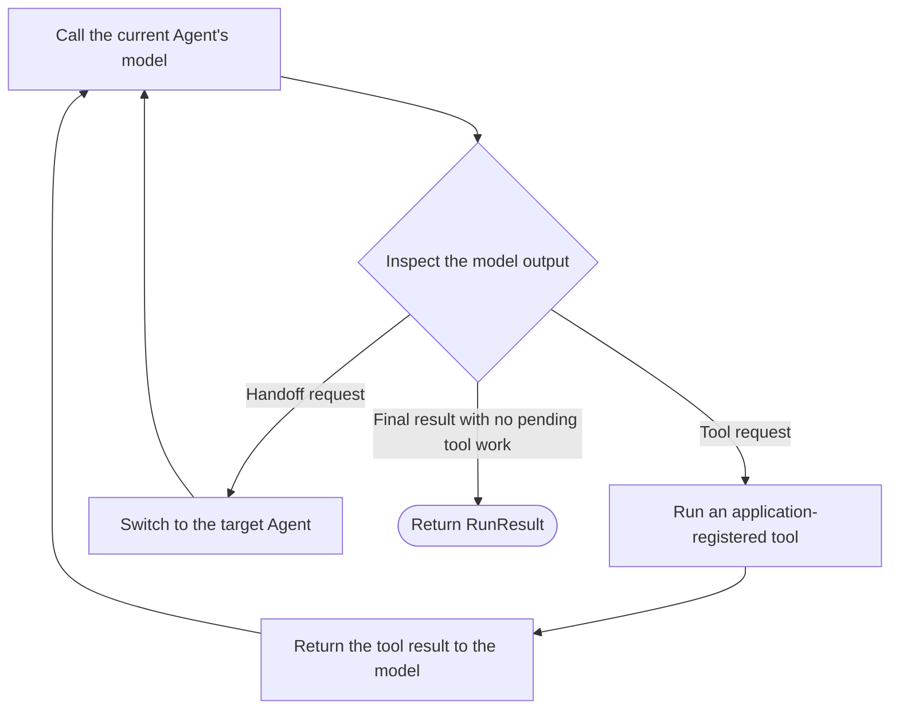

<p class="lesson-kicker">M00 · 45 minutes · concepts + lab</p>

# Run your first Agent

<p class="lesson-deck">See the smallest complete Agent run before writing your first real program.</p>

<div class="lesson-meta" aria-label="Lesson information">
  <span>SDK v0.19.1</span>
  <span>9 review questions</span>
  <span>1 model run</span>
  <span>1 trace check</span>
</div>

## Learning outcomes

After this chapter, you should be able to:

- explain the main difference between the Agents SDK and calling the Responses API directly;
- distinguish an `Agent`, one `Runner.run`, and the `RunResult` it returns;
- explain why one run may call the model more than once;
- explain why reusing the same `Agent` does not carry conversation history into the next run;
- read the final result from `final_output`;
- run one Agent with an explicitly configured model;
- find that run and its model call in the Trace viewer;
- explain what tracing is for and why it is not conversation memory;
- explain what the SDK manages and what the application must still manage.

!!! abstract "Chapter boundary"

    This chapter covers only the smallest run path. It does not use tools, handoffs, sessions,
    streaming, or structured output.

## Core material

### 1. The Agents SDK runs the loop for your application

When an application uses the Responses API directly, it handles every step: call the model, check
whether the model requested a tool, run the tool, send the tool result back, and decide whether to
call the model again.

With the Agents SDK, `Runner` repeats that process:



These are not two unrelated model interfaces. The Agents SDK can use the Responses API internally.
The real difference is whether your application writes and maintains the loop above.

| Call the Responses API directly | Use the Agents SDK |
| --- | --- |
| The application calls the model and handles each next step | `Runner` calls the model and advances the loop |
| The application decides when to call the model again | `Runner` continues or stops based on model output |
| Best when the loop must be fully custom | Best for repeated tool, handoff, and guardrail flows |

In both cases, the application still owns tool implementations, permissions, credentials,
timeouts, data storage, and business status.

### 2. `Agent` stores reusable configuration

M00 uses only three `Agent` fields:

- `name`: a human-readable name that also appears in traces;
- `instructions`: the task and constraints given to the model;
- `model`: the model explicitly selected for the exercise.

Creating an `Agent` only creates a local Python object. It does not call a model:

```python
from agents import Agent

agent = Agent(
    name="Python explainer",
    instructions="Explain one Python concept in plain language.",
    model="your-explicit-model-id",
)
```

There is no input for a run yet, so there is no model request. You can reuse the same `Agent` for
several questions; each question starts a separate run.

Reusing the same `Agent` reuses only this configuration. It does not automatically carry the
conversation history from one `Runner.run` into the next. When a later run needs earlier context,
the application must explicitly choose a state-continuation strategy. M00 does not cover those
strategies; for now, keep the boundary clear: an `Agent` is configuration, while conversation
history is separate state.

### 3. `Runner.run` performs one complete run

`Runner.run(agent, input)` receives the starting Agent and the input for this run. It executes the
agent loop until it gets a final result, the run is interrupted, or an exception occurs.

```python
result = await Runner.run(agent, "What problem does a Python context manager solve?")
print(result.final_output)
```

`Runner.run` is asynchronous, so call it with `await` inside an `async` function. A normal Python
script can use `asyncio.run(...)` to start that function.

One `Runner.run` is not the same as one model call. With no tools or handoffs, one model call is
usually enough:

```text
one Runner.run
  → model call 1: produce the final result
  → return RunResult
```

After tools are added, the same run may call the model more than once:

```text
model call 1: request a tool
  → Runner executes an application-registered tool
  → model call 2: use the tool result to produce the final result
  → return RunResult
```

M00 does not set `output_type`, so `result.final_output` is normally a string. After structured
output is added in a later chapter, it can also be a validated object.

### 4. The application still controls the boundaries

The SDK can use only the capabilities that the application gives the Agent. The application must
decide:

- which tools to register;
- which resources each tool may read or write;
- where API keys and other credentials come from;
- when a run has timed out;
- how to represent completed, incomplete, and failed work;
- which input, output, and run records to store;
- how to pass the result to another program or the final user.

!!! tip "Remember"

    `Runner` advances the loop; the application defines what the loop is allowed to do.

### 5. A trace records the steps in one run

Tracing is not another copy of the conversation. Its primary purpose is to show the steps that led
to the final result. When an answer is wrong, a trace can reveal whether the problem began in the
model, a tool, a handoff, a guardrail, or ordinary application code. Representative traces can also
become cases for later evals. A trace provides evidence to inspect; it does not make the next run
remember the conversation or decide whether an answer is correct.

A trace records what happened from the beginning to the end of one workflow. A span records one
step with a start and end time, such as one model call or one function-tool call.

```text
one workflow: trace
├── Runner invocation: span
├── Agent execution: span
└── model call: span
```

In the normal server-side setup, the Agents SDK enables tracing by default and sends records to the
[OpenAI Traces dashboard](https://platform.openai.com/traces). In `v0.19.1`, the default trace
records the overall run, Runner invocation, model turn, Agent execution, and model generation. When
tools, guardrails, or handoffs are used, it records those steps too.

M00 does not use those additional capabilities. After a real run, confirm only that:

1. you can find the workflow;
2. you can find its model call.

Names and nesting in the Trace viewer may change, so the interface does not need to match the
lesson exactly.

!!! warning "A trace may contain sensitive content"

    Model and function-tool spans may store their input and output by default. Use only a public
    exercise question. Never put an API key, private source, or sensitive data in a prompt, log, or
    learning record. M04 explains how to disable sensitive-content capture.

A third-party OpenAI-compatible model and OpenAI tracing use different keys. If no `OPENAI_API_KEY`
is available for tracing, set `OPENAI_AGENTS_DISABLE_TRACING=1`. You can still complete the model
call exercise, but you have not yet passed the M00 trace check.

## Example

The example below is adapted from the official
[`examples/basic/hello_world.py`](https://github.com/openai/openai-agents-python/blob/v0.19.1/examples/basic/hello_world.py).
It keeps the smallest structure—one Agent, one run, and the final result—and uses this project's
existing `load_learning_model()` instead of an SDK default model.

```python
import asyncio

from agents import Agent, Runner

from evidence_worker.model_provider import load_learning_model


async def main() -> None:
    agent = Agent(
        name="Haiku assistant",
        instructions="You only respond in haikus.",
        model=load_learning_model(),
    )

    result = await Runner.run(agent, "Tell me about recursion in programming.")
    print(result.final_output)


if __name__ == "__main__":
    asyncio.run(main())
```

The code runs in this order:

1. `load_learning_model()` reads the explicit model configuration but sends no model request.
2. `Agent(...)` creates local configuration and also sends no model request.
3. `Runner.run(...)` starts the run; this is the first step that calls the model.
4. `Runner` places the final result in a `RunResult`.
5. The program prints `final_output`.

## Exercises

Answer the questions before expanding the reference answers.

### Concepts and code reading

1. Why does creating an `Agent` not call the model?
2. What does an `Agent` represent, and what does one `Runner.run` represent?
3. If the model requests a function tool, what executes the tool and continues calling the model?
4. Why must the application still restrict tool permissions when it uses the Agents SDK?
5. Which object and property contain the final text in M00?
6. In the example above, which line is the first one that may send a network request?
7. True or false: one `Runner.run` always calls the model exactly once.
8. True or false: if two `Runner.run` calls use the same `Agent`, the second automatically sees the
   first conversation.
9. Does a trace automatically become model context for the next run? What does it mainly help a
   developer do?

<details class="exercise-answers">
<summary>Reference answers</summary>

1. `Agent(...)` creates local configuration only. There is no run input yet.
2. An `Agent` is reusable configuration. `Runner.run` is one execution that starts with an input
   and continues until a stopping point.
3. `Runner` calls the tool registered by the application, gives the result back to the model, and
   continues the agent loop. The application still implements the tool.
4. The SDK uses registered capabilities; it does not decide which data or operations a tool may
   access.
5. Read `result.final_output` from the `RunResult` returned by `Runner.run`.
6. `await Runner.run(...)` is the first step that may call the model. Loading configuration and
   creating the `Agent` do not call it.
7. False. Tool calls or handoffs can cause the same run to contain several model calls.
8. False. Reusing an `Agent` reuses its configuration only; multi-turn conversation state must be
   continued explicitly.
9. No. A trace shows the steps that actually occurred in one run, helping developers locate errors,
   analyze timing, and collect representative cases for later evals.

</details>

### Lab: complete the first Agent

Complete these tasks in `src/evidence_worker/first_agent.py`:

1. Define an Agent that only explains Python concepts.
2. Supply the model with `load_learning_model()` instead of relying on the SDK default.
3. Call `Runner.run` with the exact question “Python 的 context manager 解决了什么问题？”.
4. Print `result.final_output`.
5. Do not add tools, sessions, streaming, structured output, or an exception wrapper.

If model configuration is missing, the existing `load_learning_model()` should report the error
immediately. Do not copy provider branches or reimplement configuration loading in this exercise.

Run the repository checks first:

```bash
uv run ruff check .
uv run pyright
uv run pytest
```

For an OpenAI model, set these variables in the current terminal:

```bash
export LEARNING_MODEL_PROVIDER=openai
export OPENAI_API_KEY=...
export OPENAI_LEARNING_MODEL=...
```

For a third-party OpenAI-compatible endpoint, set the variables described in
[Course home: Model configuration](../index.md#model-configuration). If no separate
`OPENAI_API_KEY` is available for OpenAI tracing, also set:

```bash
export OPENAI_AGENTS_DISABLE_TRACING=1
```

Run the exercise:

```bash
uv run python -m evidence_worker.first_agent
```

Completion criteria:

- the program prints an explanation of context managers;
- all repository checks pass;
- no secret appears in code or the learning log;
- when OpenAI tracing is enabled, the Trace viewer shows this run and its model call;
- without the lesson, you can explain the relationship between `Agent`, `Runner.run`, and
  `final_output`.

This lesson does not provide the complete lab implementation. The example above shows the required
shape; your task is to adapt it to the requirements and run it.

## References

Last checked: 2026-07-31. Locked project version: `openai-agents==0.19.1`.

- [OpenAI Agents SDK overview](https://developers.openai.com/api/docs/guides/agents)
- [`v0.19.1` Quickstart](https://github.com/openai/openai-agents-python/blob/v0.19.1/docs/quickstart.md)
- [`v0.19.1` Running agents](https://github.com/openai/openai-agents-python/blob/v0.19.1/docs/running_agents.md)
- [`v0.19.1` Tracing](https://github.com/openai/openai-agents-python/blob/v0.19.1/docs/tracing.md)
- [`v0.19.1` hello-world example](https://github.com/openai/openai-agents-python/blob/v0.19.1/examples/basic/hello_world.py)

Changes to the example: use the project's existing explicit model loader, change the Agent name
and question, and omit tools, handoffs, sessions, streaming, and other features outside M00.
