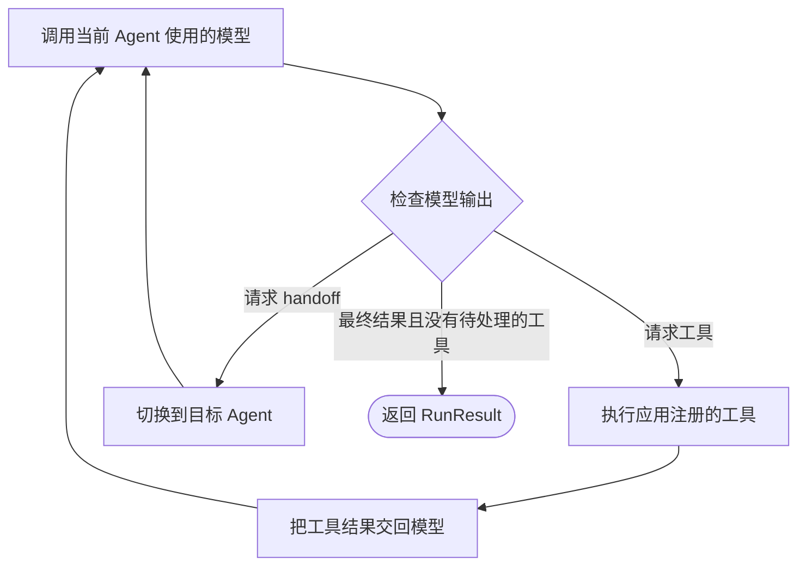

<p class="lesson-kicker">M00 · 45 分钟 · 概念 + 实战</p>

# 第一次运行 Agent

<p class="lesson-deck">先看清一次 Agent 运行的最小结构，再写第一段真实代码。</p>

<div class="lesson-meta" aria-label="课程信息">
  <span>SDK v0.19.1</span>
  <span>9 道巩固题</span>
  <span>1 次模型运行</span>
  <span>1 次 trace 检查</span>
</div>

## 学习结果

学完本章后，你应该能够：

- 说明 Agents SDK 和直接调用 Responses API 的主要区别；
- 区分 `Agent`、一次 `Runner.run` 和它返回的 `RunResult`；
- 说明为什么一次运行可能调用模型多次；
- 说明为什么复用同一个 `Agent` 不会自动继承上一次运行的对话；
- 从 `final_output` 读取最终结果；
- 运行一个显式指定模型的单 Agent；
- 在 Trace viewer 中找到这次运行和其中的模型调用；
- 说明 tracing 的用途，以及它为什么不等于对话记忆；
- 说清 SDK 管理了什么，以及应用代码仍然必须管理什么。

!!! abstract "本章边界"

    本章只学习最小运行路径，不使用工具、handoff、session、streaming 或结构化输出。

## 核心内容

### 1. Agents SDK 替应用运行循环

直接使用 Responses API 时，应用自己处理每一步：调用模型、检查模型是否请求工具、
执行工具、把工具结果发回模型，然后决定是否继续调用。

使用 Agents SDK 时，`Runner` 负责重复执行这段流程：



这不是两个互不相关的模型接口。Agents SDK 可以在内部使用 Responses API。真正的
区别是：应用是否自己编写和维护上面的循环。

| 直接使用 Responses API | 使用 Agents SDK |
| --- | --- |
| 应用自己调用模型并处理后续步骤 | `Runner` 调用模型并推进循环 |
| 应用自己决定何时再次调用模型 | `Runner` 根据模型输出继续或停止 |
| 适合需要完全自定义循环的功能 | 适合工具调用、handoff 和 guardrail 等重复流程 |

无论选择哪种方式，应用仍然负责工具实现、权限、凭据、超时、数据保存和业务状态。

### 2. `Agent` 保存可以重复使用的配置

M00 只使用 `Agent` 的三个字段：

- `name`：方便人识别这个 Agent，也会出现在 trace 中；
- `instructions`：告诉模型任务和限制；
- `model`：明确本次练习使用哪个模型。

创建 `Agent` 只会创建一个本地 Python 对象，不会调用模型：

```python
from agents import Agent

agent = Agent(
    name="Python explainer",
    instructions="Explain one Python concept in plain language.",
    model="your-explicit-model-id",
)
```

此时还没有本次问题，所以也没有模型请求。后面可以让同一个 `Agent` 回答多个问题，
每个问题分别开始一次新的运行。

复用同一个 `Agent` 只会复用这些配置，不会自动把上一次 `Runner.run` 的对话历史带入
下一次运行。需要多轮上下文时，应用必须显式选择一种状态续接方式。M00 暂不展开这些
方式，只需先分清：`Agent` 是配置，对话历史是另一份状态。

### 3. `Runner.run` 执行一次完整运行

`Runner.run(agent, input)` 接收起始 Agent 和本次输入。它会执行 agent loop，直到得到
最终结果、运行被中断，或者发生异常。

```python
result = await Runner.run(agent, "What problem does a Python context manager solve?")
print(result.final_output)
```

`Runner.run` 是异步接口，所以要在 `async` 函数中使用 `await`。普通 Python 脚本可以
用 `asyncio.run(...)` 启动这个函数。

一次 `Runner.run` 不等于一次模型调用。没有工具和 handoff 时，模型通常一次就能
给出最终结果：

```text
一次 Runner.run
  → 模型调用 1：给出最终结果
  → 返回 RunResult
```

加入工具后，同一次运行可能调用模型多次：

```text
模型调用 1：请求工具
  → Runner 执行应用注册的工具
  → 模型调用 2：根据工具结果给出最终结果
  → 返回 RunResult
```

M00 没有设置 `output_type`，所以 `result.final_output` 通常是字符串。后续章节加入
结构化输出后，它也可以是经过校验的对象。

### 4. 应用仍然控制边界

SDK 只会使用应用交给 Agent 的能力。应用必须决定：

- 注册哪些工具；
- 工具能读写哪些资源；
- API key 和其他凭据从哪里读取；
- 运行多久算超时；
- 怎样表示完成、不完整和失败；
- 保存哪些输入、输出和运行记录；
- 怎样把结果交给上层程序或最终用户。

!!! tip "记住"

    `Runner` 负责推进循环，应用负责规定循环能做什么。

### 5. trace 记录一次运行经过了哪些步骤

Tracing 的首要用途不是保存另一份对话，而是让开发者看清最终结果经过了哪些步骤。
回答错误时，可以用 trace 判断问题出在模型、工具、handoff、guardrail，还是普通业务
代码。有代表性的 trace 还可以成为后续 eval 的案例。Trace 提供检查依据，但不会让
下一次运行记住对话，也不会自动判断答案是否正确。

一个 trace 记录一次工作流从开始到结束发生的事情。一个 span 记录其中一个有开始和
结束时间的步骤，例如一次模型调用或一次函数工具调用。

```text
一次工作流：trace
├── Runner 调用：span
├── Agent 执行：span
└── 模型调用：span
```

在常规服务端配置中，Agents SDK 默认启用 tracing，并把记录发送到
[OpenAI Traces dashboard](https://platform.openai.com/traces)。`v0.19.1` 默认会记录
整次运行、Runner 调用、模型轮次、Agent 执行和模型生成。使用工具、guardrail 或
handoff 时，还会记录相应步骤。

M00 没有这些额外能力。完成真实运行后，只需确认：

1. 能找到这次工作流；
2. 能找到其中的模型调用。

Trace viewer 的名称和层级可能变化，所以不要求界面与教材截图完全相同。

!!! warning "Trace 可能包含敏感内容"

    模型调用和函数工具 span 默认可能保存输入与输出。练习只使用公开问题，不要把 API
    key、私有资料或敏感数据放入 prompt、日志或学习记录。M04 会学习怎样关闭敏感内容
    采集。

第三方 OpenAI-compatible 模型和 OpenAI tracing 使用不同的密钥。没有用于 tracing
的 `OPENAI_API_KEY` 时，应设置 `OPENAI_AGENTS_DISABLE_TRACING=1`。这样可以完成模型
调用练习，但还不能通过 M00 的 trace 检查。

## 示例

下面的例子改写自官方
[`examples/basic/hello_world.py`](https://github.com/openai/openai-agents-python/blob/v0.19.1/examples/basic/hello_world.py)。
它保留单 Agent、一次运行和读取最终结果的最小结构，并改用本项目现有的
`load_learning_model()`，避免依赖 SDK 默认模型。

```python
import asyncio

from agents import Agent, Runner

from evidence_worker.model_provider import load_learning_model


async def main() -> None:
    agent = Agent(
        name="Haiku assistant",
        instructions="You only respond in haikus.",
        model=load_learning_model(),
    )

    result = await Runner.run(agent, "Tell me about recursion in programming.")
    print(result.final_output)


if __name__ == "__main__":
    asyncio.run(main())
```

这段代码按以下顺序运行：

1. `load_learning_model()` 读取显式模型配置，但不发送模型请求；
2. `Agent(...)` 创建本地配置，也不发送模型请求；
3. `Runner.run(...)` 开始运行，此时才会调用模型；
4. `Runner` 把最终结果放入 `RunResult`；
5. 程序打印 `final_output`。

## 习题

先完成问题，再展开参考答案。

### 概念与代码阅读

1. 为什么创建 `Agent` 时没有产生模型调用？
2. `Agent` 和一次 `Runner.run` 分别表示什么？
3. 如果模型请求一个函数工具，谁执行工具并继续调用模型？
4. 为什么使用 Agents SDK 后，应用仍然必须限制工具权限？
5. M00 中应该从哪个对象、哪个属性读取最终文本？
6. 在上面的示例中，哪一行第一次可能发出网络请求？
7. 判断正误：一次 `Runner.run` 永远只调用模型一次。
8. 判断正误：两次 `Runner.run` 使用同一个 `Agent`，第二次就会自动看到第一次的对话。
9. Trace 会自动成为下一次运行的模型上下文吗？它主要帮助开发者做什么？

<details class="exercise-answers">
<summary>参考答案</summary>

1. `Agent(...)` 只创建本地配置，此时还没有运行输入。
2. `Agent` 是可以重复使用的配置；`Runner.run` 是从一份输入开始、执行到停止的一次
   运行。
3. `Runner` 调用应用已经注册的工具，把结果交回模型，然后继续 agent loop。工具本身
   仍由应用实现。
4. SDK 只负责使用已注册能力，不会替应用决定工具能访问什么数据、能执行什么操作。
5. 从 `Runner.run` 返回的 `RunResult` 中读取 `result.final_output`。
6. `await Runner.run(...)` 第一次可能调用模型。加载配置和创建 `Agent` 都不会调用模型。
7. 错。工具调用或 handoff 都可能让同一次运行包含多次模型调用。
8. 错。复用 `Agent` 只会复用配置；多轮对话必须显式续接状态。
9. 不会。Trace 用来检查一次运行实际经过了哪些步骤，帮助定位错误、分析耗时，并为
   后续 eval 提供有代表性的案例。

</details>

### 实战：完成第一个 Agent

在 `src/evidence_worker/first_agent.py` 中完成以下任务：

1. 定义一个只负责解释 Python 概念的 Agent；
2. 使用 `load_learning_model()` 提供模型，不依赖 SDK 默认值；
3. 调用 `Runner.run` 询问：“Python 的 context manager 解决了什么问题？”；
4. 打印 `result.final_output`；
5. 不添加工具、session、streaming、结构化输出或异常包装层。

如果模型配置缺失，现有 `load_learning_model()` 应直接给出错误。不要在这个练习中
复制供应商判断或重新实现配置加载。

先运行仓库检查：

```bash
uv run ruff check .
uv run pyright
uv run pytest
```

使用 OpenAI 模型时，在当前终端设置：

```bash
export LEARNING_MODEL_PROVIDER=openai
export OPENAI_API_KEY=...
export OPENAI_LEARNING_MODEL=...
```

使用第三方 OpenAI-compatible 端点时，按
[课程首页：模型配置](../index.md#模型配置)设置变量。没有单独用于 OpenAI
tracing 的 `OPENAI_API_KEY` 时，再设置：

```bash
export OPENAI_AGENTS_DISABLE_TRACING=1
```

运行练习：

```bash
uv run python -m evidence_worker.first_agent
```

完成标准：

- 程序输出对 context manager 的解释；
- 仓库检查全部通过；
- 代码和学习记录中没有密钥；
- 启用 OpenAI tracing 时，能在 Trace viewer 中找到这次运行和其中的模型调用；
- 不看教材也能解释 `Agent`、`Runner.run` 和 `final_output` 的关系。

这里不提供实战题的完整代码。上面的示例已经展示所需结构，剩下的工作是根据任务
要求完成改写并实际运行。

## 参考

本章最后核对日期：2026-07-31。项目锁定版本：`openai-agents==0.19.1`。

- [OpenAI Agents SDK overview](https://developers.openai.com/api/docs/guides/agents)
- [`v0.19.1` Quickstart](https://github.com/openai/openai-agents-python/blob/v0.19.1/docs/quickstart.md)
- [`v0.19.1` Running agents](https://github.com/openai/openai-agents-python/blob/v0.19.1/docs/running_agents.md)
- [`v0.19.1` Tracing](https://github.com/openai/openai-agents-python/blob/v0.19.1/docs/tracing.md)
- [`v0.19.1` hello-world example](https://github.com/openai/openai-agents-python/blob/v0.19.1/examples/basic/hello_world.py)

示例改动：增加项目现有的显式模型加载器，调整 Agent 名称和问题，省略工具、handoff、
session、streaming 以及其他不属于 M00 的功能。
