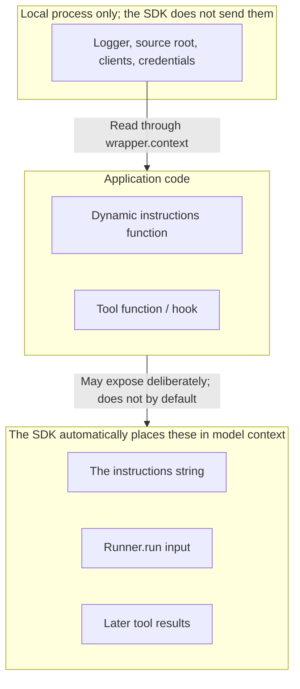

<p class="lesson-kicker">M01 · 75–90 minutes · concepts + lab</p>

# Structured results and context

<p class="lesson-deck">Give downstream code a validated object while keeping local dependencies outside the model.</p>

<div class="lesson-meta" aria-label="Lesson information">
  <span>SDK v0.19.1</span>
  <span>9 review questions</span>
  <span>1 structured run</span>
  <span>1 context boundary check</span>
</div>

## Learning outcomes

After this chapter, you should be able to:

- use Pydantic to define the `TaskRequest` received by the application and the `WorkerResult`
  returned by the worker;
- explain how `output_type` makes `final_output` a validated object;
- convert a `WorkerResult` directly to JSON without parsing model-generated prose;
- distinguish model-visible input from a local `RunContextWrapper`;
- keep dependencies such as a logger, allowed source root, and clients in local code;
- explain how application code could still expose local context to the model;
- complete one single-Agent run that returns a `WorkerResult`.

!!! note "Before you start"

    Required: all of M00 and basic familiarity with Python `dataclass` and `Path`. No prior
    Pydantic study or Agents SDK knowledge beyond M00 is required; this chapter introduces the
    remaining concepts.

!!! abstract "Chapter boundary"

    This chapter covers input, output, and context boundaries on the successful path only. It does
    not add tools or define timeout, incomplete, or failed run semantics. M02 and M03 cover those
    topics.

## Core material

### 1. Request and result models solve different problems

This course calls `TaskRequest` the request model and `WorkerResult` the result model. Both are
Pydantic data models that ordinary code can validate by field and type. The application first uses
`TaskRequest` to validate caller data. It then gives `Runner.run` only the content the model is
allowed to see. After the Agent finishes, the SDK checks the model output against `WorkerResult`
and places the validated object in `final_output`.

```text
caller JSON
  → TaskRequest: application validates input
  → select fields the model may see
  → Runner.run
  → WorkerResult: SDK validates final output
  → caller reads fields
```

The application performs the "validate input" step with `model_validate`. A missing required field
or a value that cannot be validated as its declared type immediately raises `ValidationError`.
After validation succeeds, the application builds model input from only the fields the model may
see:

```python
request = TaskRequest.model_validate(
    {
        "task_id": "task-001",
        "question": "What problem do context managers solve?",
        "requested_source_ids": ["guide"],
    }
)

model_input = (
    f"Task {request.task_id}: {request.question}\n"
    f"Allowed sources: {', '.join(request.requested_source_ids)}"
)
```

M01 shows only the successful validation path. M03 covers validation failures and error reporting.

The two models do not replace each other:

| Object | Who creates or checks it | Purpose |
| --- | --- | --- |
| `TaskRequest` | The application checks it before running the Agent | Reject tasks with missing fields or wrong types |
| `WorkerResult` | The Agent follows its schema and the SDK parses and validates it | Let downstream code read the answer, evidence, and errors consistently |

Keep the terms distinct: `TaskRequest` and `WorkerResult` are data models. Passing `WorkerResult`
to `output_type` makes the SDK generate an output schema—a JSON document that describes the output
shape—and require structured output. M03 then adds status consistency rules for the relationships
among status, answer, evidence, and errors.

`Runner.run` accepts a string or model input items. Defining `TaskRequest` does not automatically
turn that object into model input. The application must choose fields and build the input. That
step also determines what the model can see.

### 2. Define fields with Pydantic instead of specifying a prose format

`BaseModel` is a base class provided by Pydantic. It turns an ordinary Python class into a data
model that declares field types, validates values automatically, and generates JSON schema.
Pydantic is a separate library, not part of the Agents SDK. This chapter uses it to validate
application input and let the Agents SDK describe structured Agent output.

The final evidence worker will gradually gain four models:

- `TaskRequest`: the task ID, question, and source IDs the task may query;
- `Evidence`: one curated piece of evidence and its source ID;
- `WorkerError`: a machine-readable error code and a human-readable message;
- `WorkerResult`: the task ID, answer, evidence list, and error list.

M01 covers the successful path, so the error list can be empty. M03 adds `completed`, `incomplete`,
and `failed`, then defines how status and errors must agree.

Pydantic fields serve Python code and become the Agent output schema. Field names should have
stable meanings. Do not hide display text in one large string. For example, downstream code can
iterate over `result.evidence` instead of guessing source IDs from a “Sources: ...” section.

!!! tip "Make every field required first"

    The structured output models in this course make every field required. When there is no
    evidence or error, the model returns an explicit empty list. The caller always receives the
    same shape, and the model is easier to express as a strict JSON schema.

### 3. `output_type` changes the final result type

`SummaryResult` below is a simplified teaching model, not the lab's `WorkerResult`. Both are used in
the same way; substitute your own model where appropriate.

An Agent returns text by default. When you pass a Pydantic model to `output_type`, the SDK derives
a JSON schema and asks the model for structured output. `v0.19.1` uses a strict schema by default.
Strict mode rejects extra fields outside the schema and loose type coercion, making output more
predictable. The SDK then validates and parses the JSON produced by the model.

```python
from pydantic import BaseModel

from agents import Agent


class SummaryResult(BaseModel):
    topic: str
    key_points: list[str]


agent = Agent(
    name="Structured summarizer",
    instructions="Summarize the supplied public text.",
    output_type=SummaryResult,
)
```

After a successful run, `result.final_output` is a `SummaryResult`, not a JSON string that needs
another parsing step. Its runtime value in this single-Agent run is a `SummaryResult`, but the
static type of `RunResult.final_output` is `Any` because the SDK cannot guarantee that globally; a
later handoff could let an Agent with a different output type finish the run. When this chapter has
only one known Agent, check and obtain the expected type explicitly:

```python
output = result.final_output_as(SummaryResult, raise_if_incorrect_type=True)
print(output.model_dump(mode="json"))
print(output.model_dump_json())
```

`model_dump(mode="json")` returns a Python dictionary containing only JSON-compatible values.
`model_dump_json()` returns a JSON string directly. Neither requires code that splits prose by
headings or punctuation.

Structured output checks shape and field types only. It does not prove that an answer is correct
or that evidence supports a claim. The model and provider must also support the required structured
output. An unsupported run should fail instead of silently falling back to prose. M03 handles these
exceptional paths in one place.

!!! tip "OpenAI-compatible endpoints and structured output"

    With an OpenAI-compatible endpoint, confirm that the provider supports JSON schema structured
    output for the selected API. If structured output is unsupported, this chapter's run will
    fail. That is expected; do not fall back to prose.

### 4. Model context and local context are different data



“Context” commonly refers to two different kinds of data:

| Where data is placed | Does the model see it automatically? | Typical content |
| --- | --- | --- |
| `Agent.instructions`, `Runner.run` `input`, and later tool results | Yes | The question, public sources, and answer rules |
| A local object passed with `Runner.run(..., context=...)` | No | A logger, allowed source root, clients, and run dependencies |

The application creates a local object and passes it to `Runner.run`. The SDK wraps it in
`RunContextWrapper[YourContext]` for Python code in dynamic instructions, tools, hooks, and
callbacks. Pass the original object to Runner; do not construct the wrapper yourself:

```python
result = await Runner.run(agent, model_input, context=local_context)
```

Agents, tools, and hooks in one run should use the same context type. Writing
`Agent[WorkerContext]` and `RunContextWrapper[WorkerContext]` lets the type checker find code that
connects the wrong context. The square brackets are type annotations; the object is still an
`Agent` at runtime. They let pyright verify that one context type is used consistently throughout
the run.

!!! warning "Local does not mean impossible to leak"

    The SDK does not automatically send `wrapper.context` to the model. Application code can still
    expose it. For example, dynamic instructions could return a source path, or a tool could put a
    credential in its result. Return only the data needed for the task. Never return a logger,
    client, or credential.

### 5. Minimal example: use structured output and keep dependencies local

This example combines the two ideas. `SummaryResult` becomes the model output schema, while
`AppContext` remains available only to local Python code. The dynamic instructions can read the
wrapper, but the returned string contains neither the logger nor the source path.

Notice that `AppContext` is an ordinary `dataclass`, not a Pydantic `BaseModel`. Context is used only
by local Python code and does not need an SDK schema. This chapter chooses Pydantic to validate
`TaskRequest` and define `SummaryResult`; that is a course modeling choice, not an SDK requirement
for every input and output object.

```python
import asyncio
import logging
from dataclasses import dataclass
from pathlib import Path

from agents import Agent, RunContextWrapper, Runner
from pydantic import BaseModel

from evidence_worker.model_provider import load_learning_model


class SummaryResult(BaseModel):
    topic: str
    key_points: list[str]


@dataclass
class AppContext:
    logger: logging.Logger
    allowed_source_root: Path


def build_instructions(
    wrapper: RunContextWrapper[AppContext],
    agent: Agent[AppContext],
) -> str:
    wrapper.context.logger.info("starting agent=%s", agent.name)
    return "Summarize the public text and fill every field in the output schema."


async def main() -> None:
    local_context = AppContext(
        logger=logging.getLogger("learning"),
        allowed_source_root=Path("fixtures").resolve(),
    )
    agent = Agent[AppContext](
        name="Structured summarizer",
        instructions=build_instructions,
        model=load_learning_model(),
        output_type=SummaryResult,
    )

    model_input = "Topic: context managers\nPublic text: They release resources on every exit path."
    result = await Runner.run(agent, model_input, context=local_context)
    output = result.final_output_as(SummaryResult, raise_if_incorrect_type=True)
    print(output.model_dump_json())


if __name__ == "__main__":
    asyncio.run(main())
```

The code runs in this order:

1. `AppContext(...)` creates dependencies used only by local code; no model call happens.
2. `Agent[AppContext](...)` creates configuration: instructions are a function, the output schema
   is `SummaryResult`, and the model comes from `load_learning_model()`. It still makes no model
   call.
3. `Runner.run(agent, model_input, context=local_context)` starts the run and calls the model.
4. After the run, `final_output_as(SummaryResult, ...)` obtains the validated object.
5. `model_dump_json()` serializes it as a one-line JSON string and prints it.

The model sees the instructions, `model_input`, and output schema. It does not see the
`logging.Logger` object or `allowed_source_root`. The logger records the Agent name locally. The
source root is an injected dependency; the `fixtures` directory does not need to exist yet. The
read-only tool in M02 will use it.

The example's `SummaryResult` is a teaching model, not the complete `WorkerResult` answer for the
lab below.

## Exercises

Answer the questions before expanding the reference answers.

### Concepts and code reading

1. At which stage is `TaskRequest` checked, and at which stage is `WorkerResult` checked?
2. Why must the application still build `Runner.run` input after defining `TaskRequest`?
3. After setting `output_type=WorkerResult`, what should `final_output` be on a successful run?
4. Why should downstream code not extract the answer, evidence, and errors from prose?
5. How do the return values of `model_dump(mode="json")` and `model_dump_json()` differ?
6. True or false: an object passed to `Runner.run(..., context=local_context)` is automatically
   sent to the model.
7. True or false: once data is in local context, application code cannot expose it to the model.
8. Can the model in the example see `allowed_source_root`? Why?
9. Why specify both `Agent[AppContext]` and `RunContextWrapper[AppContext]`?

<details class="exercise-answers">
<summary>Reference answers</summary>

1. The application validates `TaskRequest` before running the Agent. The SDK validates and parses
   the final Agent output against the `WorkerResult` schema.
2. `Runner.run` accepts a string or model input items. It does not automatically convert an
   application Pydantic request into model input. The application must also choose which fields the
   model may see.
3. It should be a validated `WorkerResult` object. When the expected type is known, call
   `final_output_as(WorkerResult, raise_if_incorrect_type=True)` for an additional runtime check.
4. Prose headings, order, and wording can change. A structured object gives downstream code stable
   fields and types and fails directly when a field is missing or has the wrong type.
5. The first returns a JSON-compatible Python dictionary. The second returns a JSON string.
6. False. Local context is passed only to local Python code.
7. False. Dynamic instructions, tools, or hooks can read context and then write its content into
   model-visible input or a tool result.
8. No. The code does not put that path in the instructions or `model_input`, and no tool returns it.
9. The generic types let the type checker confirm that the entire run uses one local context type
   and catch incorrectly connected dependencies early.

</details>

### Lab: establish the worker's first data models

Define these Pydantic models in the model-definition module at
`src/evidence_worker/contracts.py`:

1. `TaskRequest` with `task_id: str`, `question: str`, and
   `requested_source_ids: list[str]`;
2. `Evidence` with `source_id: str` and `summary: str`;
3. `WorkerError` with `code: str` and `message: str`;
4. `WorkerResult` with `task_id: str`, `answer: str`, `evidence: list[Evidence]`, and
   `errors: list[WorkerError]`;
5. keep every field required in all four models; callers must pass explicit empty lists when there
   is no evidence or error.

Then complete one single-Agent run in `src/evidence_worker/structured_agent.py`:

1. Define a local `WorkerContext` that stores a logger and the allowed source root.
2. Create an `Agent[WorkerContext]` with `output_type=WorkerResult`.
3. Supply the model explicitly with `load_learning_model()`.
4. Validate one public exercise request with `TaskRequest`, then put only its task ID, question, and
   source IDs in model input.
5. There is no reading tool yet. Tell the Agent not to invent evidence and to return empty
   `evidence` and `errors` lists for the successful answer.
6. Pass the original `WorkerContext` to `Runner.run(..., context=...)`.
7. Check the final type, then print one JSON object with `model_dump_json()`.

Do not put the logger, source root, clients, environment variables, or credentials in instructions
or model input. Do not add tools, status classification, an exception wrapper, sessions, handoffs,
or streaming.

Run the repository checks first:

```bash
uv run ruff check .
uv run pyright
uv run pytest
```

Configure the current terminal as described in
[Course home: Model configuration](../index.md#model-configuration), then run:

```bash
uv run python -m evidence_worker.structured_agent
```

Completion criteria:

- a valid `TaskRequest` starts the run;
- a successful run returns a directly serializable `WorkerResult`, and standard output is one JSON
  object;
- write two lists in `LEARNING_LOG.md`—the fields the model saw and the objects that remained
  local—and explain the basis for each list without consulting the lesson;
- the prompt and output contain no logger, source root, client, environment-variable value, or
  credential;
- all repository checks pass.

This chapter does not provide the complete lab implementation. The `SummaryResult` example above
shows how `output_type`, context, and serialization connect. Apply the same relationships to your
four data models.

## Glossary

| Term | One-line meaning | Location |
| --- | --- | --- |
| Pydantic model | A class that declares field types, validates values, and generates JSON schema | §2 |
| JSON schema | A JSON document that describes the shape of data | §1, §2, §3 |
| Model input item | An object accepted by `Runner.run` input: a string or an SDK-defined type | §1 |
| `output_type` | Tells the SDK which type should constrain the final output | §3 |
| `final_output_as` | Casts `final_output` to a static type; with `raise_if_incorrect_type=True`, also checks the runtime type | §3 |
| Strict schema | Rejects extra fields and loose type coercion for more predictable structured output | §3 |
| `RunContextWrapper[T]` | The SDK wrapper around local context, available only to local Python code | §4 |
| context | The local object passed to `Runner.run(..., context=...)`; the model does not see it automatically | §4 |

## References

Last checked: 2026-08-01. Locked project version: `openai-agents==0.19.1`.

- [`v0.19.1` Agent definitions: output types](https://github.com/openai/openai-agents-python/blob/v0.19.1/docs/agents.md#output-types)
- [`v0.19.1` Context management](https://github.com/openai/openai-agents-python/blob/v0.19.1/docs/context.md)
- [`v0.19.1` Results: final output](https://github.com/openai/openai-agents-python/blob/v0.19.1/docs/results.md#final-output)
- [`v0.19.1` dynamic instructions example](https://github.com/openai/openai-agents-python/blob/v0.19.1/examples/basic/dynamic_system_prompt.py)
- [`v0.19.1` Agent output schema source](https://github.com/openai/openai-agents-python/blob/v0.19.1/src/agents/agent_output.py)
- [`v0.19.1` Run context source](https://github.com/openai/openai-agents-python/blob/v0.19.1/src/agents/run_context.py)

Changes to the examples: combine the official output type and dynamic instructions examples into
one single-Agent summary task; use the project's existing explicit model loader; add a logger and
allowed source root to show the local dependency boundary; omit tools, handoffs, sessions,
streaming, non-strict schemas, custom schemas, and exception handling.
