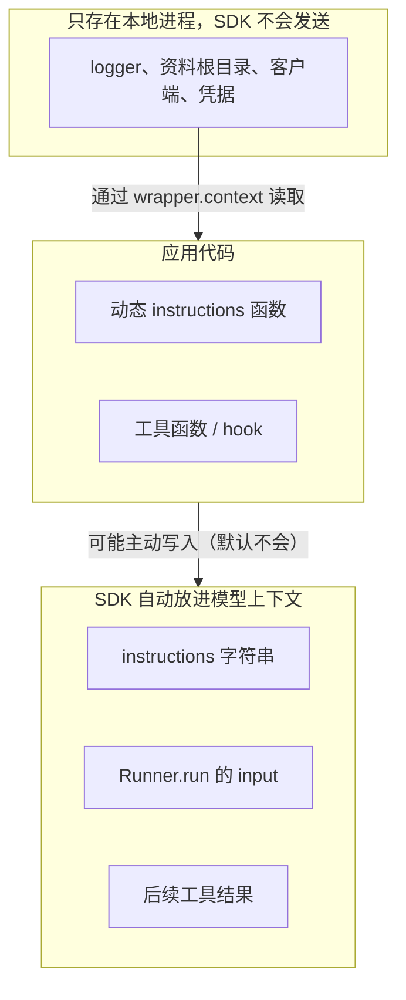

<p class="lesson-kicker">M01 · 75–90 分钟 · 概念 + 实战</p>

# 结构化结果与上下文

<p class="lesson-deck">让下游程序直接接收经过校验的对象，同时把本地依赖留在模型之外。</p>

<div class="lesson-meta" aria-label="课程信息">
  <span>SDK v0.20.0</span>
  <span>9 道巩固题</span>
  <span>1 次结构化运行</span>
  <span>1 次上下文边界检查</span>
</div>

## 学习结果

学完本章后，你应该能够：

- 用 Pydantic 分别定义应用收到的 `TaskRequest` 和用例返回的 `WorkerResult`；
- 说明 `output_type` 怎样让 `final_output` 成为经过校验的对象；
- 把 `WorkerResult` 直接转换为 JSON，而不解析模型生成的自由文本；
- 区分模型可见输入和本地 `RunContextWrapper`；
- 把 logger、允许的资料根目录和客户端等依赖留在本地代码中；
- 说明本地 context 在什么情况下仍可能被应用代码暴露给模型；
- 区分最终结构化运行结果与用户可见流式回答这两个接口问题；
- 完成一次返回 `WorkerResult` 的单 Agent 运行。

!!! note "开始之前"

    需要：M00 全部内容；Python 的 `dataclass` 和 `Path` 会用即可。不需要额外预习
    Pydantic，也不需要超出 M00 的 Agents SDK 知识——本章会补齐所需概念。

!!! abstract "本章边界"

    本章只处理正常运行中的输入、输出和 context 边界。它不添加工具，也不定义超时、
    不完整或失败的运行语义；这些内容分别留到 M02 和 M03。本章只指出结构化结果与流式
    回答的张力，不提前给出完整双通道方案；M05 会用锁定版本和目标模型做兼容性 spike。

## 核心内容

### 1. 请求模型和结果模型解决两个不同问题

本教材把 `TaskRequest` 和 `WorkerResult` 分别称为请求模型和结果模型。它们都是由普通
程序按照字段和类型检查的 Pydantic 数据模型。应用先用 `TaskRequest` 检查调用方传入的
数据，再把允许模型看到的内容交给 `Runner.run`。Agent 完成运行后，SDK 按
`WorkerResult` 检查模型输出，并把经过校验的对象放入 `final_output`。

```text
调用方 JSON
  → TaskRequest：应用检查输入
  → 选择允许模型看到的字段
  → Runner.run
  → WorkerResult：SDK 检查最终输出
  → 调用方读取字段
```

应用用 `model_validate` 执行“检查输入”这一步。缺少必填字段，或值无法校验为声明的
类型时，它会立刻抛出 `ValidationError`——这个异常就是“应用检查”的含义。检查通过后，
应用把允许模型看到的
字段拼成模型输入：

```python
request = TaskRequest.model_validate(
    {
        "task_id": "task-001",
        "question": "context manager 解决了什么问题？",
        "requested_source_ids": ["guide"],
    }
)

model_input = (
    f"Task {request.task_id}: {request.question}\n"
    f"Allowed sources: {', '.join(request.requested_source_ids)}"
)
```

M01 只展示检查成功的路径；校验失败和错误报告留给 M03。

两个模型不能互相替代：

| 对象 | 谁创建或检查 | 用途 |
| --- | --- | --- |
| `TaskRequest` | 应用在调用 Agent 前检查 | 拒绝缺字段或类型错误的任务请求 |
| `WorkerResult` | Agent 按 schema 生成，SDK 解析并检查 | 让下游程序稳定读取答案、证据和错误 |

这里要区分几个术语：`TaskRequest` 和 `WorkerResult` 是数据模型；把 `WorkerResult` 传给
`output_type` 后，SDK 据此生成输出 schema（描述输出形状的 JSON 文档），并要求 Agent
返回结构化输出；M03 再用状态
一致性规则约束状态、答案、证据和错误之间的关系。

`Runner.run` 的 `input` 接收字符串或模型输入项，不会因为你定义了 `TaskRequest` 就自动
把这个对象变成模型输入。应用必须明确选择字段并构造输入。这个动作同时确定了模型能
看到什么。

### 2. 用 Pydantic 写清字段，而不是约定一段文本格式

`BaseModel` 是 Pydantic 库提供的基类。它把普通 Python 类变成“声明字段类型 → 自动校验
→ 生成 JSON schema”的数据模型。Pydantic 是独立库，不属于 Agents SDK；本章用
它检查应用输入，并让 Agents SDK 描述 Agent 的结构化输出。

最终应用用例会逐步形成四个模型：

- `TaskRequest`：任务标识、问题和允许查询的资料标识；
- `Evidence`：一条整理后的证据及其来源标识；
- `WorkerError`：机器可判断的错误代码和给人的说明；
- `WorkerResult`：任务标识、答案、证据列表和错误列表。

M01 只处理正常路径，所以错误列表可以为空。M03 再加入 `completed`、`incomplete` 和
`failed`，并规定状态与错误之间的关系。

Pydantic 字段定义既给 Python 程序使用，也会成为 Agent 的输出 schema。字段名应该表达
稳定含义，不要把展示文字塞进一个大字符串。例如，下游程序可以直接遍历
`result.evidence`，不需要从“Sources: ...”中猜出来源。

!!! tip "先让字段全部必填"

    本课程的结构化输出模型把每个字段都写成必填项。没有证据或错误时，模型明确返回
    空列表。这样调用方始终看到同一形状，也更容易得到严格 JSON schema。

### 3. `output_type` 改变最终结果的类型

下面的 `SummaryResult` 是简化讲解模型，不是实战题的 `WorkerResult`。它与
`WorkerResult` 的用法完全相同——把你的模型替换进去即可。

Agent 默认返回文本。把 Pydantic 模型传给 `output_type` 后，SDK 会为它生成 JSON
schema，并要求模型使用结构化输出。`v0.20.0` 默认使用严格 schema——严格模式拒绝 schema 之外
的多余字段和宽松类型转换，让输出更可预测。SDK 随后校验并解析模型返回的 JSON。

```python
from pydantic import BaseModel

from agents import Agent


class SummaryResult(BaseModel):
    topic: str
    key_points: list[str]


agent = Agent(
    name="Structured summarizer",
    instructions="Summarize the supplied public text.",
    output_type=SummaryResult,
)
```

正常结束时，`result.final_output` 是 `SummaryResult`，不是等待你再次解析的 JSON 字符串。
`RunResult.final_output` 的静态类型是 `Any`：单 Agent 运行中它实际就是 `SummaryResult`，
但 SDK 的通用结果类型不能静态保证每一种运行配置。已知本章只有一个 Agent 时，可以显式
检查并取得类型：

```python
output = result.final_output_as(SummaryResult, raise_if_incorrect_type=True)
print(output.model_dump(mode="json"))
print(output.model_dump_json())
```

`model_dump(mode="json")` 返回只含 JSON 可表示值的 Python 字典；`model_dump_json()`
直接返回 JSON 字符串。两种方式都不需要按标点或标题拆分自由文本。

结构化输出只检查形状和字段类型。它不会自动证明答案正确，也不会确认某条证据真的
支持结论。模型或供应商还必须支持所需的结构化输出；不支持时应让运行失败，而不是
悄悄退回自由文本。M03 会统一处理这些异常路径。

!!! tip "OpenAI-compatible 端点与结构化输出"

    使用 OpenAI-compatible 端点时，先确认供应商支持所选 API 的 JSON schema
    结构化输出。结构化输出不被支持时，本章运行会失败——这是预期行为，
    不要退回自由文本。

### 4. 结构化最终结果与流式回答是两个接口问题

应用最终需要机器可读的 `WorkerResult`，用户却希望在运行过程中看到自然语言逐步出现。
这两个需求的时间点和数据形状不同：

| 接口 | 消费者 | 何时可用 | 需要的形状 |
| --- | --- | --- | --- |
| 结构化运行结果 | 应用代码 | run 完全结束并通过校验后 | 稳定字段、状态、证据和错误 |
| 流式用户回答 | 终端或其他 UI | run 仍在进行时 | 可以直接阅读的自然语言 delta |

设置 `output_type` 后，模型最终要产生结构化 JSON。不能由此假设 raw text delta 仍然是适合
展示的自然语言；它可能是序列化 JSON 的片段。也不能在 UI 中边收边猜 partial JSON，因为
字段顺序、转义和分块都不是稳定协议。

M01 只要求理解这项冲突。M05 会在 `openai-agents==0.20.0` 和显式目标模型上记录实际事件
形状，再选择一个只有一个 Agent、一次 Runner run、没有 Agent loop 外额外模型调用的最小双通道
方案。在 spike 完成前，不实现 partial JSON parser，也不把结构化 delta 直接显示给用户。

### 5. 模型上下文和本地 context 不是同一份数据



“上下文”常指两类完全不同的数据：

| 数据放在哪里 | 模型是否自动看到 | 典型内容 |
| --- | --- | --- |
| `Agent.instructions`、`Runner.run` 的 `input`、后续工具结果 | 是 | 问题、公开资料、回答规则 |
| `Runner.run(..., context=...)` 传入的本地对象 | 否 | logger、允许的资料根目录、客户端、运行依赖 |

应用创建本地对象并传给 `Runner.run`。SDK 把它包进
`RunContextWrapper[YourContext]`，供动态 instructions、工具、hook 和回调中的 Python
代码读取。传给 Runner 的是原始对象，不是手工创建的 wrapper：

```python
result = await Runner.run(agent, model_input, context=local_context)
```

同一次运行中的 Agent、工具和 hook 应使用同一种 context 类型。写成
`Agent[WorkerContext]` 和 `RunContextWrapper[WorkerContext]` 后，类型检查器可以发现接错
context 的代码。方括号只是类型标注，运行时与 `Agent(...)` 没有区别；这样写能让
pyright 检查整次运行使用的 context 类型是否一致。

!!! warning "本地不等于永远不会泄露"

    SDK 不会自动把 `wrapper.context` 发给模型。但应用代码仍可能主动暴露它。例如，
    动态 instructions 如果返回资料路径，或者工具把凭据放进返回值，这些内容就会进入
    模型上下文。只返回完成任务所需的数据，不要返回 logger、客户端或凭据。

### 6. 最小示例：使用结构化输出，但把依赖留在本地

下面的示例把两件事放在一起：`SummaryResult` 进入模型的输出 schema，`AppContext` 则只
供本地 Python 代码使用。动态 instructions 可以读取 wrapper，但它返回的字符串没有
包含 logger 或资料路径。

注意 `AppContext` 用的是普通 `dataclass`，不是 Pydantic 的 `BaseModel`：context 只给
本地 Python 代码使用，不需要为 SDK 生成 schema。本章选择用 Pydantic 校验
`TaskRequest` 并定义 `SummaryResult`；这是课程的建模选择，不是 SDK 对所有输入和
输出对象的硬性要求。

```python
import asyncio
import logging
from dataclasses import dataclass
from pathlib import Path

from agents import Agent, RunContextWrapper, Runner
from pydantic import BaseModel

from evidence_worker.model_provider import load_learning_model


class SummaryResult(BaseModel):
    topic: str
    key_points: list[str]


@dataclass
class AppContext:
    logger: logging.Logger
    allowed_source_root: Path


def build_instructions(
    wrapper: RunContextWrapper[AppContext],
    agent: Agent[AppContext],
) -> str:
    wrapper.context.logger.info("starting agent=%s", agent.name)
    return "Summarize the public text and fill every field in the output schema."


async def main() -> None:
    local_context = AppContext(
        logger=logging.getLogger("learning"),
        allowed_source_root=Path("fixtures").resolve(),
    )
    agent = Agent[AppContext](
        name="Structured summarizer",
        instructions=build_instructions,
        model=load_learning_model(),
        output_type=SummaryResult,
    )

    model_input = "Topic: context managers\nPublic text: They release resources on every exit path."
    result = await Runner.run(agent, model_input, context=local_context)
    output = result.final_output_as(SummaryResult, raise_if_incorrect_type=True)
    print(output.model_dump_json())


if __name__ == "__main__":
    asyncio.run(main())
```

这段代码按以下顺序运行：

1. `AppContext(...)` 创建只供本地代码使用的依赖对象，此时不调用模型；
2. `Agent[AppContext](...)` 只创建配置：instructions 是函数、输出 schema 是
   `SummaryResult`、模型来自 `load_learning_model()`，也不调用模型；
3. `Runner.run(agent, model_input, context=local_context)` 开始运行，此时才会调用模型；
4. 运行结束，`final_output_as(SummaryResult, ...)` 取回校验过的对象；
5. `model_dump_json()` 把它序列化成一行 JSON 打印出来。

这段代码中，模型能看到 instructions、`model_input` 和输出 schema。模型看不到
`logging.Logger` 对象或 `allowed_source_root`。logger 会在本地记录 Agent 名称；资料根
目录暂时只是注入的依赖（`fixtures` 目录目前不需要存在），M02 的只读工具会使用它。

示例中的 `SummaryResult` 只是讲解用模型，不是下面实战题的 `WorkerResult` 完整答案。

## 习题

先完成问题，再展开参考答案。

### 概念与代码阅读

1. `TaskRequest` 和 `WorkerResult` 分别在哪个阶段接受检查？
2. 为什么定义了 `TaskRequest` 后，仍要由应用构造 `Runner.run` 的输入？
3. 设置 `output_type=WorkerResult` 后，正常运行的 `final_output` 应是什么？
4. 为什么下游程序不应该从自由文本中提取答案、证据和错误？
5. `model_dump(mode="json")` 和 `model_dump_json()` 的返回值有什么区别？
6. 判断正误：传给 `Runner.run(..., context=local_context)` 的对象会自动发送给模型。
7. 判断正误：只要数据放在本地 context 中，应用代码就不可能把它暴露给模型。
8. 示例中的模型能看到 `allowed_source_root` 吗？为什么？
9. 为什么要同时写 `Agent[AppContext]` 和 `RunContextWrapper[AppContext]`？

<details class="exercise-answers">
<summary>参考答案</summary>

1. 应用在运行 Agent 前用 `TaskRequest` 检查调用方输入；SDK 在 Agent 产生最终结果时按
   `WorkerResult` 的 schema 校验并解析输出。
2. `Runner.run` 接收字符串或模型输入项，不会自动把应用的 Pydantic 请求对象变成模型
   输入。应用还需要明确选择哪些字段允许模型看到。
3. 它应是经过校验的 `WorkerResult` 对象。已知预期类型时，可以调用
   `final_output_as(WorkerResult, raise_if_incorrect_type=True)` 再做运行时检查。
4. 自由文本的标题、顺序和措辞可能变化。结构化对象让下游按稳定字段和类型读取，并在
   缺字段或类型错误时直接失败。
5. 前者返回 JSON 可表示的 Python 字典，后者返回 JSON 字符串。
6. 错。本地 context 只传给本地 Python 代码。
7. 错。动态 instructions、工具或 hook 仍可能读取 context，再把其中内容写进模型可见的
   输入或工具结果。
8. 看不到。代码没有把这个路径写进 instructions 或 `model_input`，也没有工具返回它。
9. 两处泛型声明让类型检查器确认整次运行使用同一种本地 context，及早发现接错依赖的
   代码。

</details>

### 实战：建立应用用例的第一组数据模型

在数据模型定义文件 `src/evidence_worker/contracts.py` 中定义以下 Pydantic 模型：

1. `TaskRequest`：包含 `task_id: str`、`question: str` 和
   `requested_source_ids: list[str]`；
2. `Evidence`：包含 `source_id: str` 和 `summary: str`；
3. `WorkerError`：包含 `code: str` 和 `message: str`；
4. `WorkerResult`：包含 `task_id: str`、`answer: str`、`evidence: list[Evidence]` 和
   `errors: list[WorkerError]`；
5. 四个模型的字段都保持必填；没有证据或错误时，调用方仍要明确提供空列表。

然后在 `src/evidence_worker/structured_agent.py` 中完成一次单 Agent 运行：

1. 定义一个本地 `WorkerContext`，其中保存 logger 和允许的资料根目录；
2. 用 `Agent[WorkerContext]` 创建 Agent，并设置 `output_type=WorkerResult`；
3. 用 `load_learning_model()` 显式提供模型；
4. 先由 `TaskRequest` 检查一份公开练习请求，再只把任务标识、问题和资料标识放进模型
   输入；
5. 本章还没有读取工具，所以要求 Agent 不编造证据，并在正常回答时返回空的
   `evidence` 和 `errors`；
6. 把原始 `WorkerContext` 传给 `Runner.run(..., context=...)`；
7. 检查最终类型，再用 `model_dump_json()` 打印一个 JSON 对象。

不要把 logger、资料根目录、客户端、环境变量或凭据拼进 instructions 或模型输入。
不要添加工具、状态分类、异常包装、session、handoff 或 streaming。

先运行仓库检查：

```bash
uv run ruff check .
uv run pyright
uv run pytest
```

按[课程首页：模型配置](../index.md#模型配置)设置当前终端，再运行：

```bash
uv run python -m evidence_worker.structured_agent
```

完成标准：

- 一份有效的 `TaskRequest` 能启动运行；
- 正常运行返回可直接序列化的 `WorkerResult`，标准输出是一个 JSON 对象；
- 把“模型看到了哪些字段”和“哪些对象只留在本地”两张清单写进 LEARNING_LOG.md，
  不看教材也能解释它们的依据；
- prompt 和输出中没有 logger、资料根目录、客户端、环境变量值或凭据；
- 仓库检查全部通过。

本章没有给出实战题的完整实现。上面的 `SummaryResult` 示例展示了
`output_type`、context 和序列化的连接方式；请把相同关系用于自己的四个数据模型。

## 术语表

| 术语 | 一句话 | 位置 |
| --- | --- | --- |
| Pydantic 模型 | 声明字段类型、自动校验、能生成 JSON schema 的类 | §2 |
| JSON schema | 描述数据形状的 JSON 文档 | §1、§2、§3 |
| 模型输入项 | `Runner.run` 的 input 可接收的对象（字符串或 SDK 定义类型） | §1 |
| `output_type` | 告诉 SDK 按哪个模型约束最终输出 | §3 |
| `final_output_as` | 把 `final_output` 转为目标静态类型；传入 `raise_if_incorrect_type=True` 时再做运行时检查 | §3 |
| 严格 schema | 拒绝多余字段与宽松类型转换，让结构化输出更可预测 | §3 |
| `RunContextWrapper[T]` | SDK 包住本地 context 的容器，只给本地 Python 代码读取 | §5 |
| context | 传给 `Runner.run(..., context=...)` 的本地对象，模型不会自动看到 | §5 |

## 版本与官方参考

本章最后核对日期：2026-08-11。项目锁定版本：`openai-agents==0.20.0`。

- [`v0.20.0` Agent definitions：output types](https://github.com/openai/openai-agents-python/blob/v0.20.0/docs/agents.md#output-types)
- [`v0.20.0` Context management](https://github.com/openai/openai-agents-python/blob/v0.20.0/docs/context.md)
- [`v0.20.0` Results：final output](https://github.com/openai/openai-agents-python/blob/v0.20.0/docs/results.md#final-output)
- [`v0.20.0` dynamic instructions example](https://github.com/openai/openai-agents-python/blob/v0.20.0/examples/basic/dynamic_system_prompt.py)
- [`v0.20.0` Agent output schema source](https://github.com/openai/openai-agents-python/blob/v0.20.0/src/agents/agent_output.py)
- [`v0.20.0` Run context source](https://github.com/openai/openai-agents-python/blob/v0.20.0/src/agents/run_context.py)

示例改动：把官方 output type 和 dynamic instructions 示例合并为一个单 Agent 摘要任务；
改用项目现有的显式模型加载器；加入 logger 和允许的资料根目录来展示本地依赖边界；
省略工具、handoff、session、streaming、非严格 schema、自定义 schema 和异常处理。
