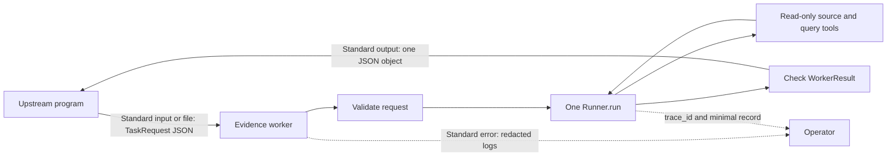

<p class="lesson-kicker">M05 · 120 minutes · capstone lab</p>

# JSON evidence worker

<p class="lesson-deck">Let an upstream program start one bounded read-only run and judge its result using only a request schema and a result schema.</p>

<div class="lesson-meta" aria-label="Lesson information">
  <span>SDK v0.19.1</span>
  <span>10 review questions</span>
  <span>7 boundary scenarios</span>
  <span>1 real end-to-end run</span>
</div>

## Learning outcomes

After this chapter, you should be able to:

- read one `TaskRequest` JSON object from standard input or a file;
- validate the request before calling a model and keep model input separate from local
  `WorkerContext`;
- connect the structured result, read-only tools, run bounds, trace, and minimal record from
  M01–M04 into one run;
- write exactly one `WorkerResult` JSON object to standard output and send logs to standard error;
- distinguish `completed`, `incomplete`, and `failed` with fixed exit codes;
- return only a curated answer, evidence references, and stable errors—not source documents or
  internal SDK items;
- cover the process protocol and main abnormal paths in tests that do not call a real model;
- complete one real-model end-to-end run with public synthetic sources.

!!! abstract "Chapter boundary"

    This chapter connects existing capabilities. It does not introduce another Agent architecture.
    The final worker has one Agent, one `Runner.run`, two read-only function tools, and one process
    entry point. It has no sessions, handoffs, streaming, write tools, or general worker framework,
    and the lesson does not provide the complete lab implementation.

## Core material

### 1. The process boundary is the product interface the caller sees

The upstream program does not need to know how many model calls ran, and it does not parse logs. It
does four things: prepare request JSON, start the worker, read result JSON, and continue according
to the status and exit code.



In this chapter, JSON-in/JSON-out has a concrete meaning:

- one process handles one task;
- input is one UTF-8 JSON object, not JSON Lines or an array of objects;
- output is one `WorkerResult` JSON object, optionally followed by one newline;
- standard output contains no heading, progress, debug text, or second JSON object;
- logs go only to standard error and do not change the result JSON;
- every process start begins a new run and does not inherit the previous process's conversation.

### 2. The application validates the request before building model input

`Runner.run` accepts a string, model input items, or a `RunState`. It does not automatically check
the process input because the project defines a `TaskRequest`. The application must parse the JSON
first and then place validated fields in model input.

```python
from pydantic import ValidationError

raw_request = read_one_request()

try:
    request = TaskRequest.model_validate_json(raw_request)
except ValidationError:
    result = invalid_request_result()
```

`model_validate_json(...)` performs JSON parsing and Pydantic validation together. Do not insert
unvalidated raw JSON into a prompt. Do not write the complete `ValidationError` to logs or the
result either; it may contain caller-supplied values. This course maps invalid JSON, missing fields,
and wrong field types to the stable code `INVALID_REQUEST`.

An invalid request may not contain a usable `task_id`. In the lab, reserve one fixed identifier for
that case and make `TaskRequest` reject the reserved value when supplied by a caller. The process
can then return a valid `failed` `WorkerResult` without guessing an identifier from damaged input.
The reserved value and `INVALID_REQUEST` are part of this project's process protocol, not built-in
Agents SDK behavior.

Pass only fields the model needs to complete the task: the task identifier, question, and allowed
source identifiers. The source root, read-only client, logger, and record path remain in local
`WorkerContext`. Request JSON must not let a caller replace these dependencies or expand tool
permissions.

### 3. One run connects M01–M04 on the same path

M05 does not copy four implementations. One request moves through the existing boundaries in this
fixed order:

```text
read one request
  → validate TaskRequest
  → build model input and local WorkerContext
  → create an Agent with output_type=WorkerResult and only two read-only tools
  → create redacted RunConfig and a unique trace_id
  → call Runner.run once with max_turns and a run-level timeout
  → final_output_as(WorkerResult, raise_if_incorrect_type=True)
  → ordinary code checks source coverage and status invariants
  → write the minimal RunRecord
  → write one WorkerResult JSON object to standard output
```

Each layer makes only the decisions it can reliably make:

| Layer | Decides | Does not decide for the next layer |
| --- | --- | --- |
| Process entry point | Whether input can be read and matches `TaskRequest` | Whether evidence is sufficient |
| Read-only tools | Whether paths and arguments are allowed and a query succeeded or timed out | Whether the final task is complete |
| `Runner` | Advances the model/tool loop and produces structured final output | Whether domain source coverage is complete |
| Application wrapper | Maps exceptions, checks coverage and status, and writes a run record | What the upstream program does next |
| Upstream program | Continues, retries, or stops based on `status`, `errors`, and exit code | The worker's internal run loop |

`final_output_as(..., raise_if_incorrect_type=True)` checks only the runtime type. The application
must still perform M03's deterministic checks: whether every requested source was handled, whether
`completed` has no blocking error, and whether `failed` has no answer or evidence. Serialize the
result only after those checks pass.

### 4. Standard output contains the result; standard error contains allowed logs

The following code shows only the process boundary. Complete `read_one_request`, `run_worker`, and
exception-to-`WorkerResult` conversion in the lab. This is not the full answer.

```python
import asyncio
import logging
import sys


EXIT_CODE = {
    "completed": 0,
    "incomplete": 2,
    "failed": 1,
}


def write_result(result: WorkerResult) -> None:
    sys.stdout.write(result.model_dump_json() + "\n")
    sys.stdout.flush()


async def main() -> int:
    request = TaskRequest.model_validate_json(read_one_request())
    result = await run_worker(request)
    write_result(result)
    return EXIT_CODE[result.status]


if __name__ == "__main__":
    logging.basicConfig(stream=sys.stderr, level=logging.INFO)
    raise SystemExit(asyncio.run(main()))
```

The exit codes are this course's process protocol, not SDK status values:

| `WorkerResult.status` | Exit code | Caller interpretation |
| --- | ---: | --- |
| `completed` | `0` | The task is complete and the answer can be used |
| `incomplete` | `2` | The JSON and partial result are usable, but the task is not complete |
| `failed` | `1` | The JSON is valid, but there is no safe domain answer to use |

The caller must still read `status` and the stable `WorkerError.code`. An exit code gives a shell or
process manager a quick signal that the task did not complete; it does not replace checking the
result model.

Every normal and mapped abnormal path must call `write_result` exactly once. Tools, hooks, and
application code must not `print(...)` to standard output. Logs contain only fixed event names,
`trace_id`, status, and error codes. Do not log the raw request, complete answer, evidence text,
tool arguments, tool output, or exception text.

### 5. Schemas describe fields; the protocol describes how to start the process

Pydantic can generate request and result JSON Schema from the same models:

```python
request_schema = TaskRequest.model_json_schema()
result_schema = WorkerResult.model_json_schema()
```

Generate and deliver these schemas outside a normal task run. Do not print schemas to a task's
standard output. The caller also needs a short process protocol: how to select standard input or a
file, the text encoding, the three exit codes, and the rule that one process handles one object.

Schema and code must come from the same models. Do not maintain a handwritten field table that can
drift away from validation. Automated checks should confirm at least that:

- the `TaskRequest` schema requires a task identifier, question, and allowed source identifiers;
- the `WorkerResult` schema contains status, answer, evidence, and errors;
- the example request validates as a `TaskRequest`;
- examples of all three result states validate as `WorkerResult`;
- validating a serialized object again does not change field meaning.

“The caller depends only on schema” does not mean the caller controls worker internals. The schema
must not expose `WorkerContext`, clients, a logger, the source root, `RunResult.new_items`, or
`raw_responses`.

### 6. Return curated results instead of copying the run and source material

The model may read long sources, and the SDK keeps tool items and raw model responses in memory.
The caller needs only enough information to continue: task status, a curated answer, evidence
locations, and stable errors.

| Location | Store or return | Do not store or return |
| --- | --- | --- |
| `WorkerResult` | Answer, `source_id`, short evidence summary, stable errors | Complete source documents, raw tool output, SDK items |
| Minimal local record | `trace_id`, status, evidence references, error codes | Prompt, complete answer, exception text |
| Trace | Span structure, tool names, timing, error location | Raw model and tool inputs and outputs |
| Standard error | Fixed event names, run ID, status, error codes | Secrets, request body, private sources, stack traces |

This boundary also limits retention. The application should not keep tool output forever because it
might be useful later. For a review, follow evidence references back to the permission-controlled
source, then use `trace_id` to inspect the run path.

### 7. Check seven boundary scenarios from outside the process

Testing internal functions alone does not prove the JSON process protocol. At least one
deterministic test group should act like a new caller: start the entry point, capture standard
output, standard error, and the exit code, and use a fake runner with no network code.

| Scenario | Expected status | Stable error example | Exit code |
| --- | --- | --- | ---: |
| Successful completion | `completed` | None | `0` |
| Requested source is missing | `incomplete` | `SOURCE_MISSING` | `2` |
| Evidence is insufficient but a trusted partial result exists | `incomplete` | Project-defined domain error | `2` |
| Read-only query fails | `failed` | `TOOL_FAILURE` | `1` |
| Asynchronous tool times out | `failed` | `TOOL_TIMEOUT` | `1` |
| Complete run times out | `failed` | `RUN_TIMEOUT` | `1` |
| Input is not a valid `TaskRequest` | `failed` | `INVALID_REQUEST` | `1` |

For every scenario, pass standard output to `WorkerResult.model_validate_json(...)` first. If a log,
second JSON object, or debug text appears before or after the result, this check should fail. Then
assert status, error code, and exit code. Standard error may contain allowed logs, but test it with
conspicuous forbidden strings to ensure it contains no secret, request body, evidence text, tool
input/output, or exception text.

Default tests continue to exclude `smoke` and control results or exceptions through M04's runner
injection point. A real model is used only in the explicit end-to-end run.

### 8. A real run proves only that the current minimum path works

Run deterministic checks first:

```bash
uv run ruff check .
uv run pyright
uv run pytest
```

After explicitly configuring a model and credentials, use a public synthetic request to check file
input and standard input:

```bash
uv run python -m evidence_worker.cli fixtures/requests/complete.json
uv run python -m evidence_worker.cli < fixtures/requests/complete.json
```

Both commands should write only one `completed` JSON object to standard output and return exit code
`0`. Use at least one as this chapter's real end-to-end evidence. Then find the run in the Trace
viewer with the local record's `trace_id` and inspect model turns, tool-call order, and the
sensitive-content setting.

The run proves that the current model, configuration, read-only tools, and process entry point were
connected successfully at least once. It does not prove that every source is answerable, that the
provider will remain reliable, or that the worker is production-ready.

## Exercises

Answer the questions before expanding the reference answers.

### Concepts and code reading

1. After defining `TaskRequest`, why must the process entry point still call
   `model_validate_json(...)`?
2. Why should unvalidated raw JSON not be inserted directly into model input?
3. What output is excluded by “standard output contains one JSON object”?
4. Which exit codes does this chapter assign to `completed`, `incomplete`, and `failed`?
5. Why must the caller still read `status` and `WorkerError.code` instead of checking only the exit
   code?
6. Why should `WorkerResult` not contain source documents, `new_items`, or `raw_responses`?
7. Where should request and result JSON Schema come from, and why should they not be handwritten?
8. Why do a missing source and a failed read-only query use different statuses?
9. How can a process-level deterministic test check the JSON protocol without calling a real
   model?
10. What does one real end-to-end run prove, and what does it not prove?

<details class="exercise-answers">
<summary>Reference answers</summary>

1. `Runner.run` does not validate the project's process protocol. The entry point must parse JSON
   and reject fields or types that do not match `TaskRequest`.
2. Unvalidated input may omit fields, use wrong types, or contain content that must not control
   local dependencies. Validate first, then select only task fields for model input.
3. It excludes headings, progress, debug text, logs, schemas, a second result, and any tool
   `print(...)`. One trailing newline is allowed.
4. `completed` is `0`, `incomplete` is `2`, and `failed` is `1`.
5. Exit codes give only a coarse signal. JSON status and stable error codes explain whether a
   partial result exists and whether the cause is a missing source, tool failure, or timeout.
6. The caller needs curated results. Returning source documents or SDK internals makes more copies
   of private data and couples the caller to SDK representations.
7. Generate them from `TaskRequest.model_json_schema()` and `WorkerResult.model_json_schema()`.
   Validation and schema then share one source instead of drifting through manual maintenance.
8. A missing source may still leave a trusted partial answer, so it is `incomplete`. In this
   chapter, a failed query means no domain answer is safe to use, so it is `failed`.
9. Start the entry point from outside, capture both standard streams and the exit code, and inject
   M04's fake runner into the same run path. The fake has no network code and supplies a fixed
   result or exception.
10. It proves that the current model configuration, read-only tools, run wrapper, and process entry
    point worked together once. It does not prove input quality, long-term reliability, or
    production readiness.

</details>

### Lab: finish the bounded read-only evidence worker

Complete these tasks in the same project evolved through the first four chapters. Do not copy a
parallel worker or rename the process skeleton above and treat it as the complete answer.

1. Keep M01's `TaskRequest`, `Evidence`, `WorkerError`, and `WorkerResult`, and add M03's status
   invariants. Reserve a fixed task identifier for invalid requests that cannot collide with a
   normal task.
2. Add one process entry point. Read standard input when there is no input-file argument, or read
   one UTF-8 file when there is one. Accept one JSON object per process.
3. Validate input with `TaskRequest.model_validate_json(...)`. Map invalid JSON, missing fields,
   and wrong types to `failed`, `INVALID_REQUEST`, and exit code `1`.
4. Generate and check request and result JSON Schema from the same Pydantic models. Do not print
   them during a normal task run.
5. Create one Agent with `output_type=WorkerResult` and register only M02's source reader and
   read-only query tool.
6. Connect M03's `max_turns=6`, 20-second run-level timeout, tool error mapping, source coverage
   check, and status validation to this one run. Keep the query tool's 2-second per-call timeout.
7. Connect M04's redacted `RunConfig`, unique `trace_id`, minimal `RunRecord`, and runner injection
   point to the same path.
8. Call `model_dump_json()` exactly once for standard output. The logger, tools, and hooks write
   only allowed fields to standard error.
9. Implement fixed exit codes: `completed=0`, `incomplete=2`, and `failed=1`.
10. Use a fake runner and public synthetic fixtures to cover the seven scenarios in the table.
    From outside the process, assert one JSON object, status, error code, exit code, and redacted
    logs.
11. Run default tests and every repository check first. Then explicitly configure a model and
    complete one real end-to-end run using file or standard input.
12. Review model turns and read-only tool calls by `trace_id`. Do not store complete source
    documents, raw tool output, `new_items`, or `raw_responses`.

Run all repository checks first:

```bash
uv run ruff check .
uv run pyright
uv run pytest
```

Then explicitly run one real end-to-end request:

```bash
uv run python -m evidence_worker.cli fixtures/requests/complete.json
```

Completion criteria:

- a new caller can integrate using only the request and result JSON Schema plus the short process
  protocol;
- standard output always contains exactly one `WorkerResult` JSON object, and logs go only to
  standard error;
- success, missing source, incomplete result, tool failure, tool timeout, run timeout, and invalid
  request all have stable assertions;
- the run can be reviewed with a trace and minimal record without keeping raw tool output forever;
- there are no sessions, handoffs, write tools, or general frameworks;
- default tests do not call a real model, while the real end-to-end run uses public synthetic
  sources and leaves a reviewable `trace_id`;
- without looking at the finished implementation, you can rebuild the core skeleton: “read request
  → validate → run once → check result → write JSON.”

This chapter does not provide the complete lab implementation. The process skeleton shows only the
connection points for standard streams and exit codes. You must still connect Agent instructions,
tool implementations, status constructors, exception mapping, record writing, and test helpers from
M01–M04.

## References

Last checked: 2026-08-02. Locked project version: `openai-agents==0.19.1`.

- [Current Agents SDK guide: overall positioning](https://developers.openai.com/api/docs/guides/agents)
- [`v0.19.1` Agent output types](https://github.com/openai/openai-agents-python/blob/v0.19.1/docs/agents.md#output-types)
- [`v0.19.1` Runner loop and input](https://github.com/openai/openai-agents-python/blob/v0.19.1/docs/running_agents.md#runner-lifecycle-and-configuration)
- [`v0.19.1` RunResult and final output](https://github.com/openai/openai-agents-python/blob/v0.19.1/docs/results.md#final-output)
- [`v0.19.1` Runner.run source](https://github.com/openai/openai-agents-python/blob/v0.19.1/src/agents/run.py)
- [`v0.19.1` final_output_as source](https://github.com/openai/openai-agents-python/blob/v0.19.1/src/agents/result.py)
- [`v0.19.1` hello-world process entry example](https://github.com/openai/openai-agents-python/blob/v0.19.1/examples/basic/hello_world.py)
- [Pydantic JSON parsing](https://docs.pydantic.dev/latest/concepts/json/)
- [Pydantic JSON Schema](https://docs.pydantic.dev/latest/concepts/json_schema/)
- [Pydantic serialization](https://docs.pydantic.dev/latest/concepts/serialization/)
- [Python 3.12 standard streams and exit](https://docs.python.org/3.12/library/sys.html)

Changes to the examples: keep the single Agent, `Runner.run`, `output_type`, `final_output`, and
`asyncio.run` path from the official documentation and hello-world example; add this course's
`TaskRequest` validation, read-only tools, run bounds, redacted trace, minimal record, standard
streams, and exit codes; remove free-text output, sessions, handoffs, streaming, writes, real private
sources, and the complete lab answer.
