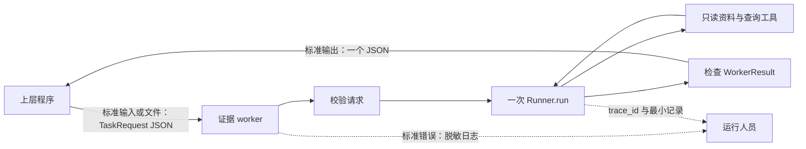

<p class="lesson-kicker">M05 · 120 分钟 · 核心实战</p>

# JSON 证据工作器

<p class="lesson-deck">让上层程序只用一份请求 schema 和一份结果 schema，就能启动一次有边界的只读运行并判断结果。</p>

<div class="lesson-meta" aria-label="课程信息">
  <span>SDK v0.19.1</span>
  <span>10 道巩固题</span>
  <span>7 个边界场景</span>
  <span>1 次真实端到端运行</span>
</div>

## 学习结果

学完本章后，你应该能够：

- 从标准输入或一个文件读取单个 `TaskRequest` JSON；
- 在调用模型前校验请求，并把模型输入与本地 `WorkerContext` 分开；
- 把 M01–M04 的结构化结果、只读工具、运行边界、trace 和最小记录接成一次运行；
- 让标准输出只包含一个 `WorkerResult` JSON，把日志写到标准错误；
- 用固定退出码区分 `completed`、`incomplete` 和 `failed`；
- 只向调用方返回整理后的答案、证据引用和稳定错误，不返回源文档或 SDK 内部 items；
- 在不调用真实模型的测试中覆盖进程协议和主要异常路径；
- 完成一次使用公开合成资料的真实模型端到端运行。

!!! abstract "本章边界"

    本章连接已有能力，不再引入新的 Agent 架构。最终 worker 只有一个 Agent、一次
    `Runner.run`、两个只读函数工具和一个进程入口。它不使用 session、handoff、streaming、
    写工具或通用 worker 框架，也不在教材中给出实战题的完整实现。

## 核心内容

### 1. 进程边界就是调用方看到的产品接口

上层程序不需要知道模型调用了几次，也不需要解析日志。它只做四件事：准备请求 JSON、
启动 worker、读取结果 JSON、根据状态和退出码继续处理。



JSON-in/JSON-out 在本章中的具体含义是：

- 一次进程只处理一个任务；
- 输入是一个 UTF-8 JSON 对象，不是 JSONL，也不是对象数组；
- 输出是一个 `WorkerResult` JSON 对象，结尾可以有一个换行；
- 标准输出没有标题、进度、调试文本或第二个 JSON；
- 日志只写标准错误，不改变结果 JSON；
- 每次启动都开始一次新运行，不继承上一次进程的对话。

### 2. 应用先检查请求，再构造模型输入

`Runner.run` 接收字符串、模型输入项或 `RunState`。它不会因为项目定义了
`TaskRequest` 就自动检查进程输入。应用必须先解析 JSON，再把经过校验的字段放进模型输入。

```python
from pydantic import ValidationError

raw_request = read_one_request()

try:
    request = TaskRequest.model_validate_json(raw_request)
except ValidationError:
    result = invalid_request_result()
```

`model_validate_json(...)` 同时完成 JSON 解析和 Pydantic 校验。不要先把未校验的原始 JSON
拼进 prompt，也不要把 `ValidationError` 的完整文本写到日志或结果中；其中可能包含调用方
提供的值。本课程把无效 JSON、字段缺失和字段类型错误统一映射为稳定的
`INVALID_REQUEST`。

无效请求可能没有可用的 `task_id`。实战应为这种情况保留一个固定标识，并让
`TaskRequest` 拒绝调用方使用这个保留值。这样，进程仍能返回合法的 `failed`
`WorkerResult`，又不会从损坏的输入中猜测任务标识。保留值和 `INVALID_REQUEST` 都属于本项目
的进程协议，不是 Agents SDK 的内置行为。

调用 Agent 时只放模型完成任务需要的字段：任务标识、问题和允许的资料标识。资料根目录、
只读客户端、logger 和记录路径仍放在本地 `WorkerContext` 中。请求 JSON 不能让调用方替换
这些依赖或扩大工具权限。

### 3. 一次运行把 M01–M04 接在同一条路径上

M05 不复制四套代码。一个请求按下面的固定顺序经过已有边界：

```text
读取一个请求
  → TaskRequest 校验
  → 构造模型输入和本地 WorkerContext
  → 创建 output_type=WorkerResult 的 Agent，只注册两个只读工具
  → 生成脱敏 RunConfig 和唯一 trace_id
  → 用 max_turns 与运行级 timeout 调用一次 Runner.run
  → final_output_as(WorkerResult, raise_if_incorrect_type=True)
  → 普通程序检查资料覆盖和状态约束
  → 写入最小 RunRecord
  → 标准输出一个 WorkerResult JSON
```

每一层只做自己能可靠判断的事：

| 层 | 负责判断 | 不能替下一层判断 |
| --- | --- | --- |
| 进程入口 | 输入能否读取、JSON 是否符合 `TaskRequest` | 证据是否足够 |
| 只读工具 | 路径和参数是否允许、查询是否成功或超时 | 最终任务是否完成 |
| `Runner` | 推进模型与工具循环、产生结构化最终输出 | 领域资料是否覆盖完整 |
| 应用包装层 | 异常映射、资料覆盖、状态约束、运行记录 | 上层程序下一步做什么 |
| 上层程序 | 根据 `status`、`errors` 和退出码继续、重试或停止 | worker 内部运行循环 |

`final_output_as(..., raise_if_incorrect_type=True)` 只确认运行时类型。应用仍要执行 M03 的
确定性检查：请求资料是否都已处理，`completed` 是否没有阻塞错误，`failed` 是否没有答案和
证据。检查通过后，才允许序列化结果。

### 4. 标准输出只写结果，标准错误只写允许的日志

下面的代码只展示进程边界。`read_one_request`、`run_worker` 和异常到
`WorkerResult` 的转换由实战补齐；这不是完整答案。

```python
import asyncio
import logging
import sys


EXIT_CODE = {
    "completed": 0,
    "incomplete": 2,
    "failed": 1,
}


def write_result(result: WorkerResult) -> None:
    sys.stdout.write(result.model_dump_json() + "\n")
    sys.stdout.flush()


async def main() -> int:
    request = TaskRequest.model_validate_json(read_one_request())
    result = await run_worker(request)
    write_result(result)
    return EXIT_CODE[result.status]


if __name__ == "__main__":
    logging.basicConfig(stream=sys.stderr, level=logging.INFO)
    raise SystemExit(asyncio.run(main()))
```

退出码是本课程定义的进程协议，不是 SDK 状态：

| `WorkerResult.status` | 退出码 | 调用方应怎样理解 |
| --- | ---: | --- |
| `completed` | `0` | 任务完整，可以使用答案 |
| `incomplete` | `2` | JSON 和部分结果可用，但任务没有完整完成 |
| `failed` | `1` | JSON 可解析，但没有可安全使用的领域答案 |

调用方仍应读取 `status` 和稳定的 `WorkerError.code`。退出码只让 shell 或进程管理器快速知道
任务是否完整完成，不能代替对结果模型的检查。

所有正常和已映射的异常路径都必须只调用一次 `write_result`。工具、hooks 和应用代码都不能
向标准输出 `print(...)`。日志只包含固定事件名、`trace_id`、状态和错误代码；不要记录原始
请求、完整答案、证据正文、工具参数、工具输出或异常文本。

### 5. Schema 告诉调用方字段，协议告诉调用方怎样启动进程

Pydantic 可以从同一组模型生成请求和结果 JSON Schema：

```python
request_schema = TaskRequest.model_json_schema()
result_schema = WorkerResult.model_json_schema()
```

在正常任务运行之外生成并交付这两份 schema，不要在任务的标准输出中打印 schema。调用方
还需要一页很短的进程协议：如何选择标准输入或文件、文本编码、三个退出码，以及一次进程只
处理一个对象。

Schema 与代码必须来自同一组模型。不要手写一份逐渐失真的字段表。自动检查至少确认：

- `TaskRequest` schema 要求任务标识、问题和允许的资料标识；
- `WorkerResult` schema 包含状态、答案、证据和错误；
- 示例请求能由 `TaskRequest` 校验；
- 三种状态的示例结果都能由 `WorkerResult` 校验；
- 序列化后再次校验不会改变字段含义。

“调用方只依赖 schema”不表示调用方能控制 worker 内部对象。Schema 中不能出现
`WorkerContext`、客户端、logger、资料根目录、`RunResult.new_items` 或 `raw_responses`。

### 6. 返回整理结果，不复制运行过程和源资料

模型可能读取很长的资料，SDK 也会在内存中保留工具 items 和原始模型响应。调用方只需要
能继续工作的信息：任务状态、整理后的答案、证据定位和稳定错误。

| 位置 | 保存或返回 | 不保存或返回 |
| --- | --- | --- |
| `WorkerResult` | 答案、`source_id`、短证据摘要、稳定错误 | 整份源文档、工具原始输出、SDK items |
| 最小本地记录 | `trace_id`、状态、证据引用、错误代码 | prompt、完整答案、异常文本 |
| Trace | span 结构、工具名、时间、错误位置 | 模型和工具原始输入输出 |
| 标准错误 | 固定事件名、运行标识、状态、错误代码 | 密钥、请求正文、私有资料、堆栈 |

这条边界也限制保留时间。应用不应为了“以后也许要查”而无限保存工具输出。真正需要复查时，
用证据引用回到受权限控制的原资料，再用 `trace_id` 查看运行路径。

### 7. 从进程外部检查七个边界场景

只测试内部函数不足以证明 JSON 进程协议。至少有一组确定性测试应像新调用方一样启动入口，
捕获标准输出、标准错误和退出码，并保证假 runner 没有网络代码。

| 场景 | 预期状态 | 稳定错误示例 | 退出码 |
| --- | --- | --- | ---: |
| 正常完成 | `completed` | 无 | `0` |
| 请求资料缺失 | `incomplete` | `SOURCE_MISSING` | `2` |
| 证据不足但已有可信部分结果 | `incomplete` | 项目定义的领域错误 | `2` |
| 只读查询失败 | `failed` | `TOOL_FAILURE` | `1` |
| 异步工具超时 | `failed` | `TOOL_TIMEOUT` | `1` |
| 整次运行超时 | `failed` | `RUN_TIMEOUT` | `1` |
| 输入不是有效 `TaskRequest` | `failed` | `INVALID_REQUEST` | `1` |

每个场景先把标准输出交给 `WorkerResult.model_validate_json(...)`。如果输出前后混入日志、第二个
JSON 或调试文本，这一步就应失败。然后再断言状态、错误代码和退出码。标准错误可以有允许的
日志，但必须用明显的禁止字符串检查它不含密钥、请求正文、证据正文、工具输入输出或异常
文本。

默认测试继续排除 `smoke`，并通过 M04 的 runner 注入点控制返回或异常。真实模型只在显式
端到端运行中使用。

### 8. 真实运行只证明当前最小路径能走通

先运行确定性检查：

```bash
uv run ruff check .
uv run pyright
uv run pytest
```

显式配置模型和凭据后，用公开合成请求分别检查文件输入和标准输入：

```bash
uv run python -m evidence_worker.cli fixtures/requests/complete.json
uv run python -m evidence_worker.cli < fixtures/requests/complete.json
```

两次命令都应只向标准输出写一个 `completed` JSON，并返回退出码 `0`。至少选择其中一次作为
本章真实端到端证据，再用本地记录中的 `trace_id` 在 Trace viewer 检查模型轮次、工具调用
顺序和敏感内容设置。

这次运行能证明当前模型、配置、只读工具和进程入口至少成功连接一次。它不能证明所有资料都
能回答、供应商长期稳定，或 worker 已经达到生产就绪。

## 习题

先完成问题，再展开参考答案。

### 概念与代码阅读

1. 为什么定义了 `TaskRequest` 后，进程入口仍要调用 `model_validate_json(...)`？
2. 为什么不能把未校验的原始 JSON 直接放进模型输入？
3. “标准输出只有一个 JSON”具体排除了哪些输出？
4. 本章为 `completed`、`incomplete` 和 `failed` 分别规定了什么退出码？
5. 为什么调用方仍要读取 `status` 和 `WorkerError.code`，不能只看退出码？
6. 为什么 `WorkerResult` 不应包含源文档、`new_items` 或 `raw_responses`？
7. 请求和结果 JSON Schema 应从哪里生成，为什么不手写？
8. 资料缺失和只读查询失败为什么使用不同状态？
9. 进程级确定性测试怎样同时检查 JSON 协议并避免真实模型调用？
10. 一次真实端到端运行能证明什么，不能证明什么？

<details class="exercise-answers">
<summary>参考答案</summary>

1. `Runner.run` 不检查项目自己的进程协议。入口必须先解析 JSON，并按 `TaskRequest` 的字段
   和类型拒绝无效请求。
2. 未校验输入可能缺字段、带错误类型或夹带不允许控制的内容。先校验，再只选择任务需要的
   字段进入模型输入，可以保持权限和依赖边界。
3. 它排除标题、进度、调试文本、日志、schema、第二个结果和工具自己的 `print(...)`。结果
   后可以有一个换行。
4. `completed` 是 `0`，`incomplete` 是 `2`，`failed` 是 `1`。
5. 退出码只能给出粗粒度信号。JSON 中的状态和稳定错误代码才能说明是否有部分结果，以及
   缺资料、工具失败还是超时。
6. 调用方只需要整理结果。返回源文档或 SDK 内部对象会扩大私有数据副本，也会把调用方绑在
   SDK 内部表示上。
7. 分别从 `TaskRequest.model_json_schema()` 和 `WorkerResult.model_json_schema()` 生成。这样
   schema 与实际校验模型来自同一来源，不会因手工维护而逐渐分离。
8. 资料缺失时可能仍有可信的部分答案，所以是 `incomplete`；查询失败时本章不认为领域答案
   可以安全使用，所以是 `failed`。
9. 测试从入口外捕获标准输出、标准错误和退出码，并把 M04 的假 runner 注入同一运行路径。
   假 runner 预先返回结果或异常，不含网络代码。
10. 它证明当前模型配置、只读工具、运行包装和进程入口至少连接成功一次。它不能证明所有
    输入质量、长期可靠性或生产就绪。

</details>

### 实战：完成有边界的只读证据 worker

在前四章不断演进的同一个项目上完成以下任务。不要复制一套平行 worker，也不要把本章的
进程骨架直接改名当作完整答案。

1. 保留 M01 的 `TaskRequest`、`Evidence`、`WorkerError` 和 `WorkerResult`，加入 M03 的状态
   约束；为无效请求规定不能与正常任务冲突的固定任务标识；
2. 新增一个进程入口：没有输入文件参数时读取标准输入，有一个文件参数时读取该 UTF-8
   文件；一次只接受一个 JSON 对象；
3. 用 `TaskRequest.model_validate_json(...)` 检查输入；把无效 JSON、字段缺失和类型错误映射
   为 `failed`、`INVALID_REQUEST` 和退出码 `1`；
4. 从同一组 Pydantic 模型生成并检查请求与结果 JSON Schema，不在正常任务输出中打印它们；
5. 创建一个 `output_type=WorkerResult` 的 Agent，只注册 M02 的资料读取和只读查询工具；
6. 把 M03 的 `max_turns=6`、20 秒运行级超时、工具错误映射、资料覆盖检查和状态校验接入这
   一次运行；保留查询工具的 2 秒单次超时；
7. 把 M04 的脱敏 `RunConfig`、唯一 `trace_id`、最小 `RunRecord` 和 runner 注入点接入同一
   路径；
8. 标准输出只调用一次 `model_dump_json()`；logger、工具和 hooks 只写标准错误，并只写允许
   字段；
9. 实现固定退出码：`completed=0`、`incomplete=2`、`failed=1`；
10. 用假 runner 和公开合成 fixture 覆盖表中的七个场景；从进程外断言一个 JSON、状态、错误
    代码、退出码和脱敏日志；
11. 先运行默认测试和完整仓库检查，再显式配置模型，完成一次文件或标准输入的真实端到端
    运行；
12. 用 `trace_id` 复查模型轮次和只读工具调用，不保存完整源文档、工具原始输出、`new_items`
    或 `raw_responses`。

先运行完整仓库检查：

```bash
uv run ruff check .
uv run pyright
uv run pytest
```

然后显式运行一次真实端到端请求：

```bash
uv run python -m evidence_worker.cli fixtures/requests/complete.json
```

完成标准：

- 一个全新的调用方只依赖请求和结果 JSON Schema 以及短进程协议，就能正确调用；
- 标准输出始终只有一个 `WorkerResult` JSON，日志只写标准错误；
- 正常、资料缺失、结果不完整、工具失败、工具超时、运行超时和无效请求都有稳定断言；
- 运行过程可用 trace 和最小记录复查，但不会无限保存工具原始输出；
- 没有 session、handoff、写工具或通用框架；
- 默认测试不会调用真实模型；真实端到端运行使用公开合成资料并留下可查的 `trace_id`；
- 不看现成实现，也能重新写出“读请求 → 校验 → 单次运行 → 检查结果 → 输出 JSON”的核心
  骨架。

本章不提供实战完整实现。进程骨架只展示标准输入输出与退出码的连接点；Agent 指令、工具
实现、状态构造函数、异常映射、记录写入和测试 helper 仍由你把 M01–M04 的成果接起来。

## 参考

本章最后核对日期：2026-08-02。项目锁定版本：`openai-agents==0.19.1`。

- [当前 Agents SDK 指南：整体定位](https://developers.openai.com/api/docs/guides/agents)
- [`v0.19.1` Agent 输出类型](https://github.com/openai/openai-agents-python/blob/v0.19.1/docs/agents.md#output-types)
- [`v0.19.1` Runner 循环与输入](https://github.com/openai/openai-agents-python/blob/v0.19.1/docs/running_agents.md#runner-lifecycle-and-configuration)
- [`v0.19.1` RunResult 与最终输出](https://github.com/openai/openai-agents-python/blob/v0.19.1/docs/results.md#final-output)
- [`v0.19.1` Runner.run 源码](https://github.com/openai/openai-agents-python/blob/v0.19.1/src/agents/run.py)
- [`v0.19.1` final_output_as 源码](https://github.com/openai/openai-agents-python/blob/v0.19.1/src/agents/result.py)
- [`v0.19.1` hello-world 进程入口示例](https://github.com/openai/openai-agents-python/blob/v0.19.1/examples/basic/hello_world.py)
- [Pydantic JSON 解析](https://docs.pydantic.dev/latest/concepts/json/)
- [Pydantic JSON Schema](https://docs.pydantic.dev/latest/concepts/json_schema/)
- [Pydantic 序列化](https://docs.pydantic.dev/latest/concepts/serialization/)
- [Python 3.12 标准流与退出](https://docs.python.org/3.12/library/sys.html)

示例改动：保留官方文档与 hello-world 示例中的单 Agent、`Runner.run`、`output_type`、
`final_output` 和 `asyncio.run` 最小路径；加入课程自己的 `TaskRequest` 校验、只读工具、运行
边界、脱敏 trace、最小记录、标准输入输出和退出码；移除自由文本输出、session、handoff、
streaming、写操作、真实私有资料和实战完整答案。
